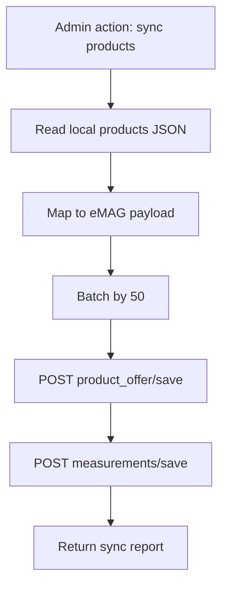
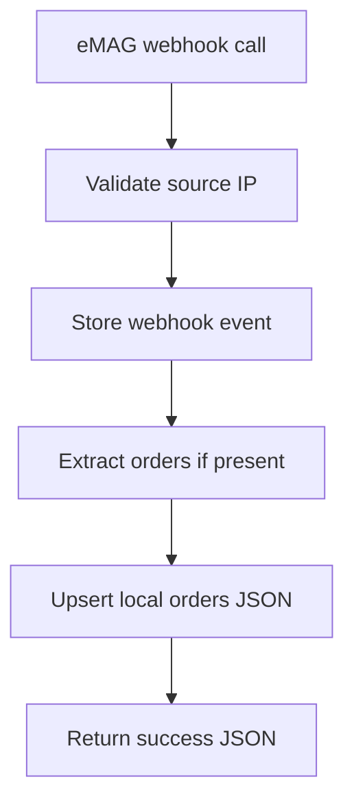

# eMAG Marketplace Integration

This project integrates with eMAG Marketplace API version 4.5.2 using Next.js App Router route handlers.

## Environment Variables

Set the following variables in your environment file.

- EMAG_USERNAME: eMAG API username
- EMAG_PASSWORD: eMAG API password
- EMAG_BASE_URL: marketplace base URL, example https://marketplace-api.emag.bg/api-3
- EMAG_ADMIN_TOKEN: token required by the eMAG admin API routes (recommended)
- EMAG_WEBHOOK_ALLOWED_IPS: comma-separated list of source IPs allowed to call webhook endpoint
- EMAG_CATEGORY_MAP_JSON: JSON map from local category key to eMAG category id
- EMAG_CATEGORY_ID_DEFAULT: fallback category id when category key is missing
- EMAG_VAT_ID: default eMAG VAT id
- EMAG_WAREHOUSE_ID: default eMAG warehouse id
- EMAG_HANDLING_TIME_DAYS: default handling time value
- EMAG_BRAND: fallback brand name
- EMAG_DEFAULT_EAN: fallback EAN when unknown
- EMAG_SOURCE_LANGUAGE: source language for product content, default bg_BG
- EMAG_DEFAULT_WEIGHT_GRAMS: fallback measurement weight
- EMAG_DEFAULT_WIDTH_MM: fallback measurement width
- EMAG_DEFAULT_HEIGHT_MM: fallback measurement height
- EMAG_DEFAULT_LENGTH_MM: fallback measurement length
- EMAG_PUBLIC_SITE_URL: base URL used to convert relative product image paths to absolute URLs
- EMAG_OVERRIDES_PATH: optional path for product-level eMAG overrides JSON (advanced mode only)

## Implemented Routes

- POST /api/emag/sync-products
- POST /api/emag/update-stock
- POST /api/emag/update-price
- POST /api/emag/orders
- GET /api/emag/orders
- POST /api/emag/webhook

All protected routes accept token by one of these methods:

- x-admin-token header
- Authorization: Bearer token
- query string token parameter

## Route Details

### POST /api/emag/sync-products

- Reads all products from data/products/products.json
- Maps products to eMAG offer payload
- Sends batches to /product_offer/save
- Sends measurements in matching batches to /measurements/save
- Returns sync report with failed batches

### POST /api/emag/update-stock

- Reads all products from data/products/products.json
- Maps product quantity to eMAG stock payload
- Updates stock in batches via /offer/save

### POST /api/emag/update-price

- Reads all products from data/products/products.json
- Maps finalPriceEur to sale_price
- Updates prices in batches via /offer/save

### POST /api/emag/orders

- Reads latest orders from /order/read
- Accepts optional filters in request body
- Saves orders locally in data/emag/orders.json

### GET /api/emag/orders

- Reads saved orders from local storage
- Supports limit query parameter

### POST /api/emag/webhook

- Validates source IP against allowed list
- Stores incoming event in data/emag/webhook-events.json
- Attempts to extract and upsert orders from webhook payload

## Request Body Conventions

The implementation follows the eMAG OpenAPI body conventions:

- save/write endpoints are sent with data array wrapper
- read/count endpoints are sent with top-level filters

## Recommended Data Ownership

To avoid duplicated maintenance:

- Keep prices, quantity, and EAN in the main Prices sheet.
- Keep brand, dimensions, and fallback eMAG metadata as environment defaults.

Main import script now reads EAN from the Prices sheet into data/products/products.json.

## Product Overrides Exchange (Optional)

If you need per-product exceptions for brand/description/measurements later, use an override source file:

- data/products/emag.overrides.json

Supported override fields per product:

- brand
- ean
- stock
- description
- weight
- width
- height
- length

The import script can also populate overrides directly from an Excel sheet:

- npm run prices:import -- --file "<your-file.xlsx>" --use-overrides-sheet --overrides-sheet "emag_overrides"

Expected columns on emag_overrides sheet:

- id or model (required)
- brand
- ean
- stock
- description
- weight
- width
- height
- length

## Rate Limit Strategy

The eMAG client includes an in-memory throttle:

- orders resources: up to 12 requests per second
- all other resources: up to 3 requests per second

Note: throttle state is process-local and may reset on deployment or server restart.

## API Flow Diagrams

## Troubleshooting

- 401 unauthorized
  - Check EMAG_ADMIN_TOKEN
  - Include x-admin-token or bearer token in request

- 403 forbidden_source_ip on webhook
  - Check EMAG_WEBHOOK_ALLOWED_IPS
  - Confirm forwarding headers are set by your proxy

- eMAG rate limit exceeded
  - Reduce call frequency
  - Retry with exponential backoff

- Missing or rejected category mapping
  - Set EMAG_CATEGORY_MAP_JSON and EMAG_CATEGORY_ID_DEFAULT
  - Verify category ids with /category/read

- Product sync succeeds but offer visibility is missing
  - Review eMAG validation rules and response messages
  - Confirm mandatory category attributes in eMAG catalog

## Admin UI

A lightweight operator page is available at:

- /admin/emag

Use this page to trigger sync, stock update, price update, and order retrieval operations and inspect raw API responses.
